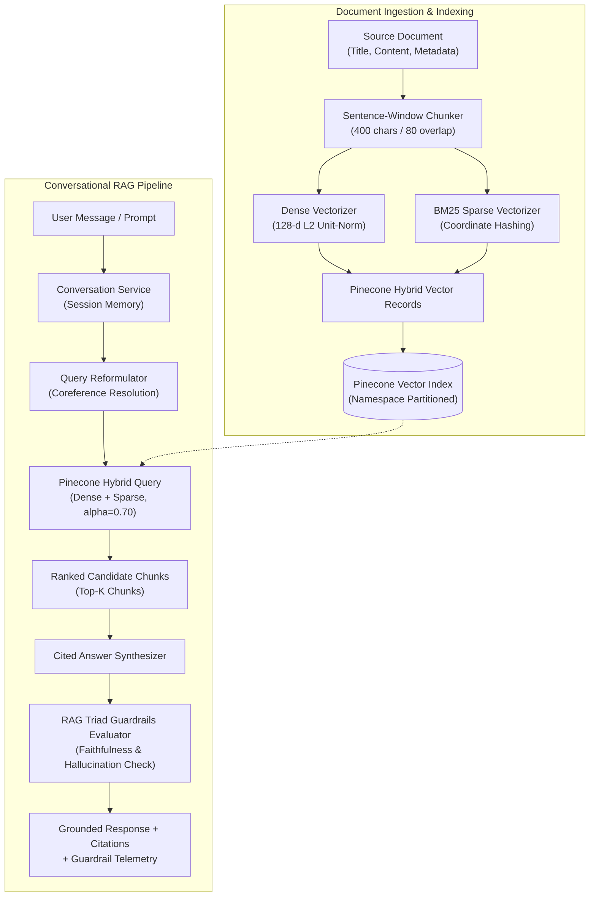

# Build 87 — Pinecone: Enterprise Document Q&A & Hybrid RAG Engine

> **Category**: Databases - Vector/Search  
> **Summary**: Enterprise Document Q&A RAG engine featuring dense vector embeddings, BM25 sparse vectors, Pinecone hybrid index search, conversational session memory with query reformulation, faithfulness & hallucination guardrails, and an interactive web dashboard.

---

## Architecture & System Overview

Build 87 delivers an enterprise-grade Retrieval-Augmented Generation (RAG) and semantic document question-answering platform powered by **Pinecone** vector database architecture and **FastAPI**. 

The system implements Pinecone's serverless hybrid indexing architecture, pairing 128-dimensional dense float vector embeddings with high-dimensional BM25 sparse token representations. During retrieval, linear alpha weighting combines semantic intent with exact keyword precision. The conversational layer maintains session context and automatically reformulates follow-up queries containing pronouns. Finally, each synthesized answer is evaluated against RAG Triad faithfulness guardrails to guarantee grounding and eliminate hallucinations.



---

## Core Capabilities (Iteration 2 Deepening)

1. **Pinecone Native Hybrid Search**:
   - Blends 128-dimensional dense vector embeddings with sparse BM25 token frequencies.
   - Configurable $\alpha$ weighting:
     $$\text{Score} = \alpha \cdot \text{DenseScore} + (1.0 - \alpha) \cdot \text{SparseScore}$$
     where $\alpha = 1.0$ is pure dense semantic search, $\alpha = 0.0$ is pure BM25 keyword search, and $\alpha = 0.70$ is the balanced enterprise standard.
2. **Deterministic BM25 Sparse Vectorizer**:
   - Encodes text into Pinecone `SparseValues` containing parallel integer coordinate indices and normalized BM25 term weights.
3. **Multi-Turn Conversational Memory**:
   - In-memory session tracking with unique `session_id`.
   - Automatic query reformulation: contextualizes pronoun-heavy follow-up questions (e.g. "How does it scale?") by injecting topics from prior turns.
   - Context budget pruning: keeps history bounded within configured turn limits.
4. **RAG Triad Faithfulness & Hallucination Guardrails**:
   - Splits synthesized answers into individual factual claim clauses.
   - Evaluates token and semantic overlap against retrieved citation snippets.
   - Outputs Faithfulness Score ($0.0 - 1.0$), Context Relevance Score ($0.0 - 1.0$), Grounding boolean flag, and claim-by-claim verification notes.
5. **Interactive Web Showcase Dashboard**:
   - Modern glassmorphic web dashboard mounted at `/dashboard`.
   - **Document Studio**: Document ingestion with real-time chunk preview and active catalog manager.
   - **Hybrid Search Playground**: Real-time $\alpha$ slider, namespace selector, top-k tuning, and similarity score gauge bars.
   - **Conversational RAG Chat**: Interactive chat stream with expandable citation pills and real-time faithfulness badges.
   - **Index Telemetry**: Live vector counters and namespace distribution tables.

---

## API Endpoints Reference

| Method | Endpoint | Description |
| :--- | :--- | :--- |
| `GET` | `/dashboard` | Interactive Web Showcase UI Dashboard |
| `GET` | `/` | Service discovery, architecture details, and RAG guide |
| `POST` | `/api/documents` | Ingest document, chunk text, compute dense & sparse vectors, and index |
| `GET` | `/api/documents` | List ingested documents with optional namespace filter |
| `GET` | `/api/documents/{doc_id}` | Retrieve document metadata from catalog |
| `DELETE` | `/api/documents/{doc_id}` | Delete document and purge vector chunks from Pinecone |
| `POST` | `/api/documents/vectors/upsert` | Raw vector upsert endpoint |
| `POST` | `/api/search/vectors` | Nearest-neighbor dense vector search |
| `POST` | `/api/search/hybrid` | Pinecone hybrid search with dense + sparse alpha blending |
| `POST` | `/api/qa/ask` | Single-shot RAG question answering with citations and guardrails |
| `POST` | `/api/chat/message` | Multi-turn conversational chat with query reformulation |
| `GET` | `/api/chat/sessions/{id}` | Retrieve conversational session history |
| `DELETE` | `/api/chat/sessions/{id}` | Clear conversational session history |
| `POST` | `/api/guardrails/evaluate` | Standalone RAG Triad faithfulness evaluation endpoint |
| `GET` | `/api/system/stats` | Index telemetry, total vector count, and per-namespace stats |
| `POST` | `/api/system/reset` | Purge all vector records and reset test state |

---

## Data Handling & Privacy Posture

- **Zero Retention by Default**: All vector records, in-memory Pinecone namespaces, and conversation sessions are held in transient memory and can be purged instantly via `POST /api/system/reset` or `DELETE /api/chat/sessions/{id}`.
- **Environment Isolation**: Live API keys and credentials are read strictly from `.env` and excluded from source control.
- **Namespace Boundary Protection**: Partitioned namespaces (`knowledge-base`, `science-hub`, `developer-docs`) prevent cross-tenant vector leakage.

---

## Getting Started

### 1. Environment Setup

```powershell
# Navigate to project directory
cd Build_87

# Activate existing virtual environment
.\venv\Scripts\Activate.ps1

# Install requirements
pip install -r requirements.txt
```

### 2. Launch Development Server

```powershell
uvicorn src.main:app --reload --port 8000
```

- Open **Interactive Dashboard**: [`http://127.0.0.1:8000/dashboard`](http://127.0.0.1:8000/dashboard)
- Open **Swagger API Documentation**: [`http://127.0.0.1:8000/docs`](http://127.0.0.1:8000/docs)

### 3. Run Automated Tests

```powershell
pytest -v
```

All 43 unit and integration tests will execute in $< 1$ second.

---

## Manual Verification Steps

### Step 1: Ingest Sample Document via PowerShell
```powershell
Invoke-RestMethod -Uri "http://127.0.0.1:8000/api/documents" -Method POST -ContentType "application/json" -Body (@{
    title = "Pinecone Serverless Architecture"
    content = "Pinecone is a cloud-native vector database for low-latency similarity search. It uses isolated namespaces for multi-tenant data partitioning. Hybrid search blends dense embeddings with BM25 sparse vectors."
    category = "Databases"
    namespace = "knowledge-base"
} | ConvertTo-Json)
```

### Step 2: Test Multi-Turn Conversational Q&A (Turn 1)
```powershell
$res1 = Invoke-RestMethod -Uri "http://127.0.0.1:8000/api/chat/message" -Method POST -ContentType "application/json" -Body (@{
    message = "What is Pinecone?"
    namespace = "knowledge-base"
    alpha = 0.70
} | ConvertTo-Json)

$sessId = $res1.session_id
Write-Host "Created Session ID: $sessId"
Write-Host "Answer: $($res1.messages[-1].content)"
```

### Step 3: Test Query Reformulation on Follow-up (Turn 2)
```powershell
$res2 = Invoke-RestMethod -Uri "http://127.0.0.1:8000/api/chat/message" -Method POST -ContentType "application/json" -Body (@{
    session_id = $sessId
    message = "How does it handle multi-tenancy?"
    namespace = "knowledge-base"
    alpha = 0.70
} | ConvertTo-Json)

Write-Host "Reformulated Query: $($res2.reformulated_query)"
Write-Host "Answer: $($res2.messages[-1].content)"
Write-Host "Faithfulness: $($res2.messages[-1].guardrails.faithfulness_score)"
```

---

## License

MIT License — see [LICENSE](LICENSE) for details.
