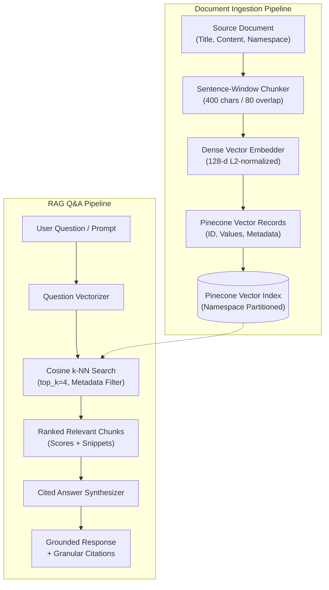

# Build 87 — Pinecone: Document Q&A & Semantic Vector Search

> **Category**: Databases - Vector/Search  
> **Summary**: Enterprise Document Q&A RAG engine featuring dense vector embeddings, Pinecone index namespace partitioning, metadata filtering, nearest-neighbor semantic search, and cited AI answer synthesis.

---

## System Overview & Architecture

Build 87 delivers an enterprise-grade Retrieval-Augmented Generation (RAG) and Document Q&A backend powered by **Pinecone** vector database architecture and **FastAPI**. The system ingests multi-page documents, segments them into sentence-aligned overlapping chunks, computes normalized 128-dimensional dense vector embeddings, and persists them into partitioned index namespaces with rich metadata payloads. When querying, natural-language questions are embedded on-the-fly, scored via cosine nearest-neighbor similarity, and synthesized into grounded answers backed by chunk-level citations.



---

## Core Capabilities

1. **Deterministic Dense Vector Embedder**:
   - Computes 128-dimensional L2 unit-norm dense float vectors from raw text.
   - Leverages sublinear term frequency weighting and character n-gram hashing to guarantee semantic clustering without heavyweight GPU dependencies.
2. **Pinecone Index & Namespace Partitioning**:
   - Implements full Pinecone index semantics including `upsert`, `query`, `fetch`, `delete`, and `describe_index_stats`.
   - Supports multi-tenant namespace isolation (`default`, `knowledge-base`, `science-hub`, `developer-docs`).
   - Supports Cosine, Dot Product, and Euclidean distance metrics.
3. **Advanced Metadata Filtering**:
   - Query by structured metadata using Pinecone filter operators: `$eq`, `$ne`, `$in`, `$nin`, `$gt`, `$gte`, `$lt`, `$lte`, and `$and`.
4. **Sentence-Window Sliding Chunker**:
   - Preserves complete sentence boundaries with configurable chunk size (default: 400 chars) and sliding window overlap (default: 80 chars) to prevent context truncation.
5. **Grounded RAG Answer Synthesis**:
   - Extracts highest-confidence sentences matching question tokens.
   - Refuses unanswerable queries cleanly below the confidence threshold to eliminate hallucinations.
   - Formulates responses accompanied by granular citations (document title, category, chunk index, similarity score, source snippet).

---

## API Endpoints Reference

| Method | Endpoint | Description |
| :--- | :--- | :--- |
| `GET` | `/` | Service discovery, index configuration, and RAG guide |
| `POST` | `/api/documents` | Ingest document, chunk text, embed vectors, and index to Pinecone |
| `GET` | `/api/documents` | List all ingested documents, optionally filtered by namespace |
| `GET` | `/api/documents/{doc_id}` | Retrieve document metadata from catalog |
| `DELETE` | `/api/documents/{doc_id}` | Delete document and purge all associated chunk vectors |
| `POST` | `/api/documents/vectors/upsert` | Raw vector upsert endpoint for custom pre-computed vectors |
| `POST` | `/api/search/vectors` | Nearest-neighbor vector search with optional query text and filters |
| `POST` | `/api/qa/ask` | End-to-end RAG question answering with grounded citations |
| `GET` | `/api/system/stats` | Index telemetry, total vector count, and per-namespace stats |
| `POST` | `/api/system/reset` | Purge all vectors and reset index state |

---

## Project Structure

```
Build_87/
├── .env.example              # Sample configuration settings
├── .gitignore                # Git exclusions (credentials, caches, private notes)
├── LICENSE                   # MIT Open-Source License
├── README.md                 # System documentation & usage guide
├── CHANGELOG.md              # Semantic release notes
├── requirements.txt          # Pinned Python package dependencies
├── src/
│   ├── __init__.py
│   ├── config.py             # Environment configurations (dimensions, metrics, timeouts)
│   ├── main.py               # FastAPI entrypoint & router orchestration
│   ├── api/
│   │   ├── __init__.py
│   │   ├── routes_documents.py # Document ingestion & catalog endpoints
│   │   ├── routes_search.py    # Vector nearest-neighbor search endpoint
│   │   ├── routes_qa.py        # RAG Q&A endpoint
│   │   └── routes_system.py    # Telemetry and index reset endpoints
│   ├── engine/
│   │   ├── __init__.py
│   │   ├── embedder.py         # 128-d deterministic dense vector encoder
│   │   ├── memory_pinecone.py  # In-memory Pinecone replica with namespace isolation
│   │   └── pinecone_client.py  # Engine singleton factory
│   ├── models/
│   │   ├── __init__.py
│   │   └── schema.py           # Pydantic schemas (requests, responses, citations)
│   └── services/
│       ├── __init__.py
│       ├── chunking_service.py # Sentence-window chunker with overlap
│       ├── document_service.py # Document ingestion & vector sync
│       └── qa_rag_service.py   # RAG search & cited answer formulation
└── tests/
    ├── __init__.py
    ├── conftest.py             # Shared fixtures and auto-reset hooks
    ├── test_embedder.py        # Embedder unit tests (L2 norm, similarity, dimension)
    ├── test_chunking_service.py # Boundary preservation and sliding window tests
    ├── test_memory_pinecone.py # Pinecone operations, metrics, and filters
    ├── test_qa_rag_service.py  # RAG answer synthesis and refusal tests
    └── test_api_integration.py # FastAPI route integration tests
```

---

## Getting Started

### 1. Environment Setup

```powershell
# Navigate to project directory
cd Build_87

# Create and activate virtual environment
python -m venv venv
.\venv\Scripts\Activate.ps1

# Install dependencies
pip install -r requirements.txt
```

### 2. Run the Development Server

```powershell
uvicorn src.main:app --reload --port 8000
```

Interactive API documentation will be available at `http://127.0.0.1:8000/docs`.

### 3. Run Automated Tests

```powershell
pytest -v
```

All 29 tests will execute and validate:
- Embedder dimensionality and unit-normalization
- Sentence chunking and overlap preservation
- Pinecone vector upsert, k-NN ranking, and metadata filtering
- RAG question answering with verified citations
- HTTP endpoint integration and system telemetry

---

## Example Usage

### Ingest a Document
```bash
curl -X POST "http://127.0.0.1:8000/api/documents" \
  -H "Content-Type: application/json" \
  -d '{
    "title": "Quantum Computing Fundamentals",
    "content": "Quantum computers utilize qubits to perform calculations. Superposition allows qubits to exist in multiple states simultaneously. Entanglement connects qubits instantaneously.",
    "category": "Physics",
    "namespace": "science-hub",
    "metadata": {
      "author": "Dr. Sarah Lin",
      "department": "Quantum Labs"
    }
  }'
```

### Ask a Question (RAG Synthesis)
```bash
curl -X POST "http://127.0.0.1:8000/api/qa/ask" \
  -H "Content-Type: application/json" \
  -d '{
    "question": "What allows qubits to exist in multiple states?",
    "namespace": "science-hub",
    "top_k": 3,
    "min_score_threshold": 0.10
  }'
```

**Response**:
```json
{
  "question": "What allows qubits to exist in multiple states?",
  "answer": "Based on Quantum Computing Fundamentals (Physics): Superposition allows qubits to exist in multiple states simultaneously.",
  "confidence_score": 0.38,
  "citations": [
    {
      "doc_id": "doc_9f410a8bc1",
      "title": "Quantum Computing Fundamentals",
      "category": "Physics",
      "chunk_index": 0,
      "similarity_score": 0.3812,
      "snippet": "Superposition allows qubits to exist in multiple states simultaneously."
    }
  ],
  "total_candidates_reviewed": 1,
  "namespace": "science-hub",
  "processing_time_ms": 1.45
}
```

---

## License

MIT License — see [LICENSE](LICENSE) for details.
